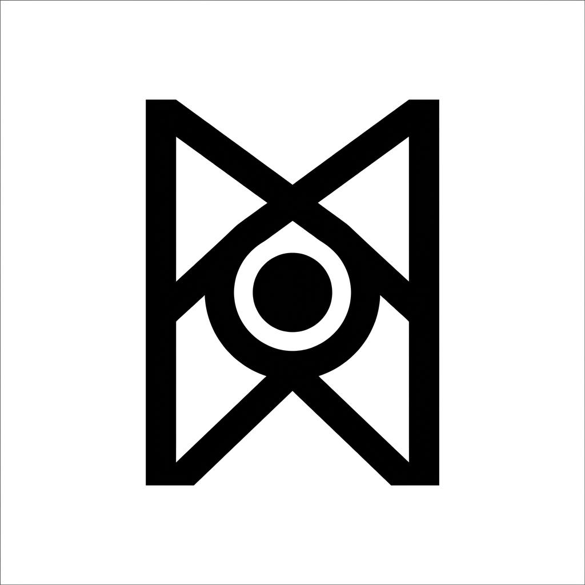

# Project Mimir



An autonomous, reactive, and expressive robotic companion built with an ESP32-CAM and STM32 Nucleo.

## ᛗ Runic Symbolism
The project logo features the Norse rune **Mannaz (ᛗ)** representing humanity and the mind, combined with a central camera lens. This symbolizes the camera's core objective: searching for, tracking, and identifying human faces. The name *Mimir* refers to the wise Norse sentinel head whose well guards Odin's sacrificed eye.

## Features
*   **Neural Network Face Tracking**: Uses the ESP32-CAM to detect faces and dynamically tracks them using a Proportional-Integral (PI) motor loop.
*   **SD Card Wi-Fi Loader & OLED Selector Menu**: Reads custom networks on-the-fly from `/wifi.txt` on a MicroSD card. Allows interactively scanning and joining networks via the Nucleo OLED screen and button long-press.
*   **Dynamic Telemetry Refresh Rate**: Switch between **Eco (5s)** and **Turbo (1s)** refresh modes directly from the web dashboard to control cloud costs or increase responsiveness.
*   **Startup Link Verification**: Automatic serial handshake (`PING/PONG`) on boot to visually confirm TX/RX wire integrity.
*   **Emotion Engine**: A state machine that gives the robot a personality (Happy, Searching, Dizzy, Angry) based on sensor inputs.
*   **Sensory Suite**: Monitors room air quality (SGP30) and avoids collisions with ultrasonic sonar (HC-SR04).
*   **Cloud Telemetry**: Streams data to AWS IoT Core over MQTT.

## Expressive Personalities
Project Mimir uses its SSD1306 OLED display to express its emotions dynamically based on sensor inputs:

### HAPPY (Tracking)
```text
                   ▄█▄                     ▄█▄
                 ▄██▀██▄                 ▄██▀██▄
               ▄██▀   ▀██              ▄██▀   ▀██
               █▀       ▀              █▀       ▀

                      █▄                 ▄
                      ▀██▄             ▄██
                        ▀██▄         ▄██▀
                          ▀██▄     ▄██▀
                            ▀██▄ ▄██▀
                              ▀███▀
                                ▀
```

### ANGRY (Obstacle Alert)
```text
                        ▄█              █▄
                      ▄█▀               ▀██▄
                    ▄█▀                   ▀██▄
                  ▄█▀                       ▀██▄
                ▄█▀                           ▀██▄
               ██████████              ███████████
               ██████████              ██████████
               ██████████              ██████████
               ██████████              ██████████
               ██████████              ██████████

                                   ██████████
```

### DIZZY (Jerk/Bump)
```text
               ▀▄        ▄             ▀▄        ▄
                ▀▄      █               ▀▄      █
                 ▀▄    █                 ▀▄    █
                  ▀▄  █                   ▀▄  █
                   ▀▄█                     ▀▄█
                    █▄                      █▄
                   █ ▀▄                    █ ▀▄
                  █   ▀▄                  █   ▀▄
                 █     ▀▄                █     ▀▄
                █       ▀▄              █       ▀▄
               ▀                       ▀

                              ██   ██
                           ███  ███
```

## Documentation
Please refer to the `docs/` folder for comprehensive setup instructions:
1.  **[System Architecture](docs/system_architecture.md)**: Overview of the dual-microcontroller setup and data flow.
2.  **[Wiring Guide](docs/wiring_guide.md)**: Detailed pin-to-pin wiring for all hardware components.
3.  **[AWS IoT Setup Guide](docs/aws_iot_setup_guide.md)**: Instructions on provisioning cloud certificates and policies.

## Repository Structure
*   `/ESP32_CAM`: Arduino IDE project for the ESP32-CAM vision coprocessor.
*   `/Nucleo_F411RE`: STM32CubeIDE project for the Nucleo master controller.
*   `/docs`: Architecture diagrams and hardware setup guides.

## Quick Start
1. Copy `.env.example` to `.env` and fill in your WiFi and AWS credentials.
2. Copy `ESP32_CAM/secrets.h.example` to `ESP32_CAM/secrets.h` and paste your certificates.
3. Flash the ESP32 using the Arduino IDE.
4. Build and flash the Nucleo using STM32CubeIDE.
5. Refer to `docs/wiring_guide.md` for physical hardware connections.
