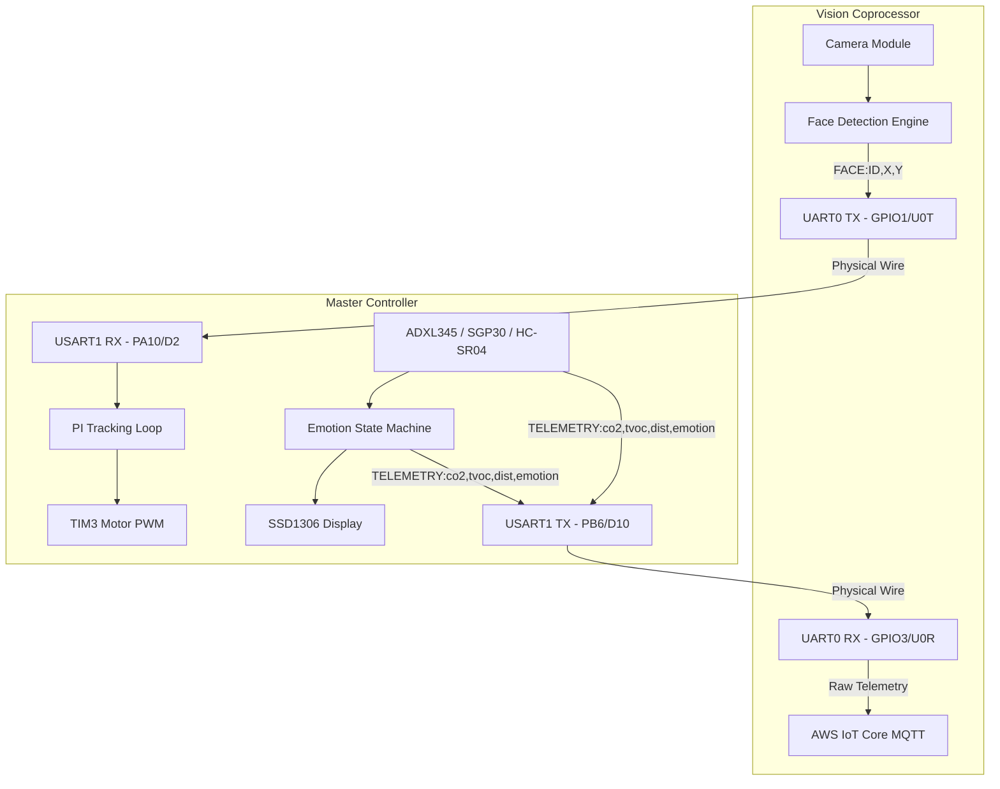

# System Architecture

DesktopBuddy utilizes a dual-microcontroller architecture to separate heavy networking/ML workloads from precise real-time hardware control.

## 1. Vision Coprocessor (ESP32-CAM)
*   **Role**: Handles all WiFi communication, AWS IoT MQTT telemetry, and local image processing.
*   **Firmware**: Arduino C++ (ESP32 core).
*   **ML Pipeline**: Runs an MTNN-based neural network to detect human faces.
*   **Output**: Transmits bounding box coordinates `FACE:ID,X,Y` over a 115200 baud UART serial connection to the Nucleo.

## 2. Master Controller (STM32 Nucleo-F411RE)
*   **Role**: Real-time operating system managing the motors, sensors, and OLED display.
*   **Firmware**: Bare-metal C generated via STM32CubeMX / HAL library.
*   **Modules**:
    *   **Proportional-Integral (PI) Controller**: Parses UART face coordinates and dynamically adjusts dual-motor PWM signals to keep the target centered.
    *   **Emotion Engine State Machine**: A `while(1)` loop that constantly evaluates sensor inputs to determine the robot's mood:
        *   `EMOTION_HAPPY` (Default/Tracking face)
        *   `EMOTION_SEARCHING` (Idle timeout > 10 seconds without face detection)
        *   `EMOTION_DIZZY` (ADXL345 accelerometer jerk detection)
        *   `EMOTION_ANGRY` (HC-SR04 ultrasonic distance < threshold)
    *   **I2C Subsystem**: Polls the SGP30 (eCO2/TVOC), ADXL345 (XYZ acceleration), and pushes bitmap frames to the SSD1306 OLED display.

## System Diagram

## 3. Advanced Features

### 3.1 SD Card Wi-Fi Loader & OLED Selection Menu
*   **SD Card Parsing**: On boot, the ESP32-CAM mounts the MicroSD card in 1-bit mode, reads Wi-Fi credentials from `/sdcard/wifi.txt`, parses them, and immediately ends the SD interface to free up pin conflicts.
*   **Preferences Storage**: The ESP32-CAM saves the last successfully connected Wi-Fi credentials in non-volatile storage (NVS) using the `Preferences` library, attempting connection to it first on next boot.
*   **OLED Wi-Fi Selector**: Long-pressing the PC13 button on the Nucleo opens the Wi-Fi Selection Menu. The user can single-press to scroll through the SSIDs and long-press to select. The Nucleo sends a `SELWIFI:<index>` UART command to trigger the ESP32-CAM to connect.
*   **Status Reporting**: The ESP32-CAM sends connection updates (`WIFISTATUS:CONNECTED`, `WIFISTATUS:FAILED`, `WIFISTATUS:CONNECTING,<SSID>`) back to the Nucleo for real-time status reporting on the OLED.

### 3.2 Dynamic Telemetry Refresh Rate
*   The dashboard allows users to adjust the telemetry refresh rate (5s Eco mode or 1s Turbo mode).
*   The dashboard publishes this change to AWS IoT Core MQTT topic `esp32/face_tracker/control`.
*   The ESP32-CAM receives it via MQTT and forwards a `SETINTERVAL:<rate>` UART packet to the Nucleo.
*   The Nucleo dynamically adjusts its internal telemetry timer to update the dashboard at the requested frequency.

### 3.3 Boot Handshake Link Verification
*   Upon boot, the Nucleo enters a loop sending `PING\n` over UART to verify the serial link.
*   The ESP32-CAM immediately responds with `PONG\n`.
*   The Nucleo marks the connection as verified (`SYS RUN  C:OK`) and displays the status on the OLED screen.
