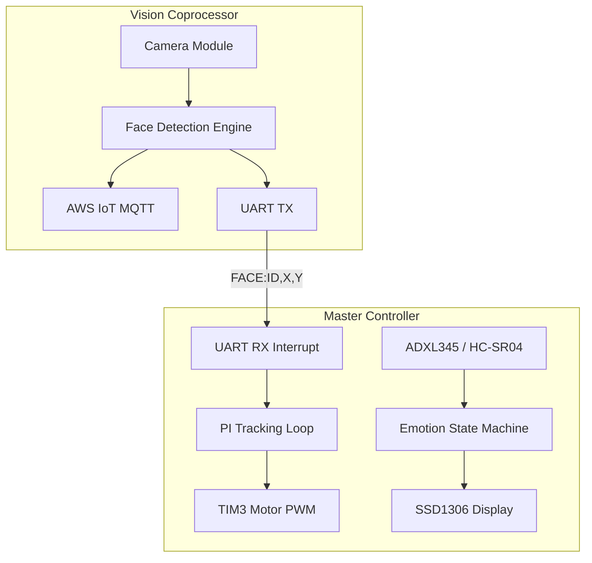

# System Architecture

DesktopBuddy utilizes a dual-microcontroller architecture to separate heavy networking/ML workloads from precise real-time hardware control.

## 1. Vision Coprocessor (ESP32-CAM)
*   **Role**: Handles all WiFi communication, AWS IoT MQTT telemetry, and local image processing.
*   **Firmware**: Arduino C++ (ESP32 core).
*   **ML Pipeline**: Runs an MTNN-based neural network to detect human faces.
*   **Output**: Transmits bounding box coordinates `FACE:ID,X,Y` over a 115200 baud UART serial connection to the Nucleo.

## 2. Master Controller (STM32 Nucleo-F411RE)
*   **Role**: Real-time operating system managing the motors, sensors, and OLED display.
*   **Firmware**: Bare-metal C generated via STM32CubeMX / HAL library.
*   **Modules**:
    *   **Proportional-Integral (PI) Controller**: Parses UART face coordinates and dynamically adjusts dual-motor PWM signals to keep the target centered.
    *   **Emotion Engine State Machine**: A `while(1)` loop that constantly evaluates sensor inputs to determine the robot's mood:
        *   `EMOTION_HAPPY` (Default/Tracking face)
        *   `EMOTION_SEARCHING` (Idle timeout > 10 seconds without face detection)
        *   `EMOTION_DIZZY` (ADXL345 accelerometer jerk detection)
        *   `EMOTION_ANGRY` (HC-SR04 ultrasonic distance < threshold)
    *   **I2C Subsystem**: Polls the SGP30 (eCO2/TVOC), ADXL345 (XYZ acceleration), and pushes bitmap frames to the SSD1306 OLED display.

## System Diagram

